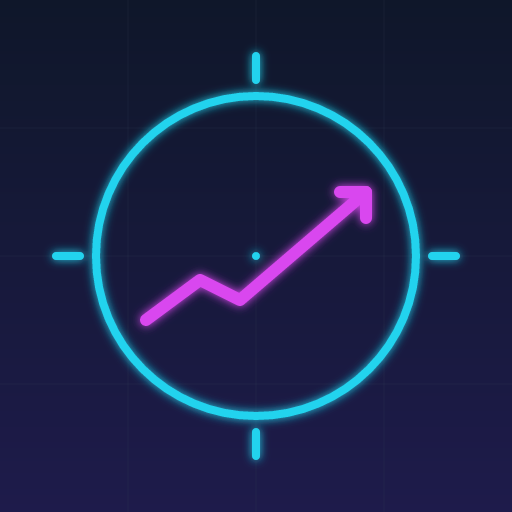

# PerpHunter - Universal Crypto Perpetuals Trading Terminal

A unified, cyber-terminal styled frontend for perpetual futures trading across decentralized exchanges. PerpHunter currently supports **Hyperliquid** and **Lighter**, offering a professional-grade interface with real-time data, sortable tables, and seamless execution.

<p align="center">
  
</p>

## 🎯 Project Overview

PerpHunter is designed for traders who demand a fast, data-rich, and intuitive interface. It abstracts the complexity of interacting with multiple DEX SDKs into a single, unified "Terminal" experience.

### Core Features
- **Multi-Exchange Support**: Trade on **Hyperliquid** (Arbitrum) and **Lighter** (Arbitrum) from one interface.
- **Terminal UI**: A cyberpunk-inspired, high-density layout optimized for desktop trading.
- **Real-Time Data**:
    - Live Orderbooks (L2 Data) via WebSocket.
    - Real-time Trade History and Ticker updates.
    - Live Position and Account Balance tracking.
- **Advanced Order Management**:
    - Limit, Market, and Stop orders (DEX dependent).
    - Sortable Order History, Open Orders, and Fills tables.
    - One-click cancel for open orders.
- **Portfolio Management**:
    - Unified view of balances and margin usage.
    - Real-time PnL tracking with sortable columns.
    - Visual indicators for leverage and ROE.

## 🛠 Technical Stack

### Frontend Core
- **React 18**: Component-based UI architecture.
- **Vite**: Next-generation frontend tooling for lightning-fast builds.
- **TypeScript**: Strict type safety across the entire codebase.
- **Tailwind CSS**: Utility-first styling with a custom "Cosmic" theme.

### State & Data
- **Zustand**: Lightweight, globally distributed state management for the Terminal.
- **Wagmi + Viem**: Robust Ethereum hooks and vanilla interactions.
- **Web3Modal**: Seamless wallet connection support (WalletConnect, MetaMask, etc.).
- **Custom Hooks**: Dedicated hooks for WebSocket management (`useWebSocket`) and Orderbook logic (`useOrderBook`).

### UI Components
- **Lucide React**: Clean, modern iconography.
- **Radix UI**: Accessible UI primitives for complex components.
- **Sortable Tables**: Custom implementation for high-performance data sorting.

## 📁 Project Structure

The project follows a modular architecture centered around the "Terminal" concept:

```
perphunter/
├── public/                 # Static assets and icons
├── src/
│   ├── components/
│   │   ├── terminal/       # Core Trading Terminal components
│   │   │   ├── Positions.tsx      # Sortable positions/orders table
│   │   │   ├── OrderBook.tsx      # Real-time L2 orderbook
│   │   │   ├── Chart.tsx          # Price chart integration
│   │   │   ├── MarketStats.tsx    # 24h ticker stats
│   │   │   └── TerminalHeader.tsx # Global status and navigation
│   │   ├── ui/             # Reusable primitives (Button, Input, Card)
│   │   └── Web3Provider.tsx # Wallet context provider
│   ├── exchanges/          # Exchange-specific logic
│   │   ├── hyperliquid/    # Hyperliquid API & WS integration
│   │   └── lighter/        # Lighter API & WS integration
│   ├── hooks/              # Shared React hooks
│   ├── store/              # Zustand stores (useTerminalStore)
│   ├── types/              # TypeScript definitions
│   └── utils/              # Helper functions
├── .env.example            # Environment variable template
└── vite.config.ts          # Vite configuration
```

## 🔧 Setup Instructions

### Prerequisites
- Node.js 18+
- npm or yarn
- A Web3 wallet (MetaMask, Rabbi, etc.)

### Installation

1. **Clone the repository**
   ```bash
   git clone https://github.com/yourusername/perphunter.git
   cd perphunter
   ```

2. **Install dependencies**
   ```bash
   npm install
   # or
   yarn install
   ```

3. **Configure Environment**
   Copy the example environment file and update it if necessary:
   ```bash
   cp .env.example .env
   ```

4. **Start Development Server**
   ```bash
   npm run dev
   ```

## 🚀 Current Status

- **Hyperliquid**: Full support for market data, order placement, and account history.
- **Lighter**: Initial integration for market data and orderbook.
- **UI**: Terminal layout is fully functional with responsive grids and sortable data tables.

## 🔮 Roadmap

- [ ] **Charting**: Integrate TradingView Lightweight Charts for advanced technical analysis.
- [ ] **More Exchanges**: Add support for GMX V2 and dYdX V4.
- [ ] **Mobile View**: Optimize the Terminal layout for mobile devices (currently desktop-first).
- [ ] **Analytics**: Advanced portfolio analytics and trade performance metrics.

## 📄 License

MIT License. See [LICENSE](./LICENSE) for details.

---

**PerpHunter** - _Trade the future, today._
